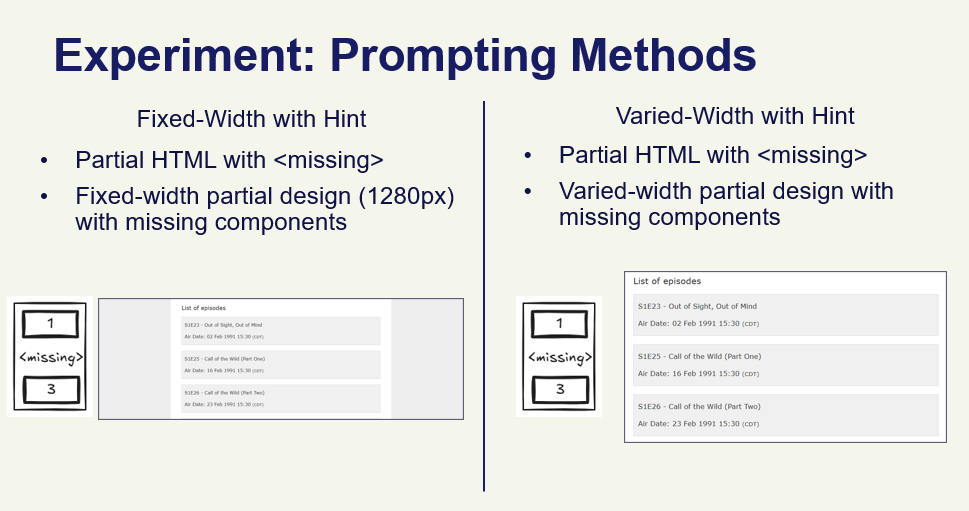
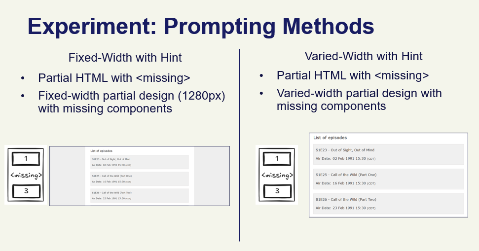

# Beyond Code: Partial UI Generation Experiments

Quick Links:
[[Dataset]]() 
[[Project Page]](https://boonhianlim.github.io/beyond-code)
[[Abstract]](https://openreview.net/forum?id=JRjTtoJman)
[[Paper]](https://hdl.handle.net/10356/184126)

The abstract of this paper is accepted for poster submission for AI4X 2025. You may read the abstact [here](https://openreview.net/forum?id=JRjTtoJman).

This repository contains scripts and utilities for running experiments related to partial frontend UI generation from sketches and designs. 

In this repository, we provide the code for running the evaluation. Our codebase built on top of [Design2Code](https://github.com/NoviScl/Design2Code) and [Sketch2Code](https://github.com/SALT-NLP/Sketch2Code), with the modifications below:
1. **Focus on partial generation instead of full generation** <br>
The main idea of this project is to extends on the idea of [Design2Code](https://github.com/NoviScl/Design2Code) and [Sketch2Code](https://github.com/SALT-NLP/Sketch2Code), but focus on generations with partial designs instead of full designs. The idea is to ask LLMs to add the design of a HTML component to the existing HTML, instead of generating the entire HTML from scratch. You may refer to our paper [here](https://hdl.handle.net/10356/184126) for more information.
1. **Split the generation code with the evaluation code** <br>
We split the evaluation part as we now evaluate the HTML under different viewports, and it is a very expensive operation that take a long time to run. 
1. **Introduce more ways to connect with models**<br>
We add more methods to connect with the models, notably using Ollama and Azure. 

## Setup

1. **Python Version**: Ensure you are using `Python >=3.10`. 
2. **Virtual environment**: You are strongly suggested to start a virtual environment for the dependencies before installing the dependencies. The easiest way to do so is:
    ```bash
    python -m venv venv
    ```
3. **Install Dependencies**: Install the required Python packages using pip:
   ```bash
    pip install -r requirements.txt
    ```
    The experiment scripts also use playwright, so make sure to run the following after installing the dependencies:
   ```bash
   playwright install
   ```
4. **Download Datasets**: To run the experiments, you would have to prepare the datasets. As a starting point, you may refer to the datasets we compiled. You can access it via this [Google Drive link](). After you download and unzip it, you should put them under `src/datasets`. <br> For example, this is how your directory should looks like:
    ```bash
    ├── src/
    │   ├── datasets/
    │   │   ├── sketch/
    │   │   ├── design/
    │   │   ├── viewport/
    ```

## Folder Structure
```bash
.
├── .gitignore
├── .python-version
├── example.bat
├── example.sh
├── README.md
├── requirements.txt
├── src/
│   ├── analysis.ipynb
│   ├── experiments/
│   │   ├── azure_design.py
│   │   ├── azure_sketch.py
│   │   ├── eval_responsive.py
│   │   ├── gemini_design.py
│   │   ├── openai_sketch.py
│   │   └── ...
│   ├── metrics/
│   └── utils/
```

## Prompting Method



## Naming convention
In our project, the experiment script are named after the datasets it expects and the prompting method it uses. 

| File name ends with    | Dataset | Prompting Method |
| --------- | ----------- | ----------- |
| *_design.py | Design | Merging |
| *_design_with_missing.py | Design | Merging with Hint |
| *_design_only.py | Design | Varied Sized with Hint |
| *_design_only_full.py | Design | Fixed Sized with Hint |
| *_sketch.py | Sketch | Merging |
| *_sketch_with_missing.py | Sketch | Merging with Hint |
| *_sketch_only.py | Sketch | Varied Sized with Hint |

## Usage
You can run experiments using the provided shell or batch scripts. You may refer to [example.bat](example.bat) and [example.sh](example.sh) to check out the examples of how to run the experiments.

The experiments are split into three parts. 
1. The first step is to generate the HTML from designs / sketches with LLMs. This step is done with using the scripts listed in [example.bat](example.bat) or [example.sh](example.sh).
2. The second step is to evaluate the generated HTMLs. You may refer to [example.bat](example.bat) or [example.sh](example.sh) for the step 2 script.
3. The third step is to retrieve the scores and visualise them for presentations. You may refer to [analysis.ipynb](src/analysis.ipynb) to run the visualisation code to make sense of the evaluation scores.

## License
The metric evaluation code in this repository is modified on top of [Design2Code](https://github.com/NoviScl/Design2Code). This part is licensed under MIT license, and you may find the license [here](licenses/DESIGN2CODE_CODE_LICENSE).

The experiment code in this repository is modified on top of [Sketch2Code](https://github.com/SALT-NLP/Sketch2Code). This part is licensed under MIT license, and you may find the license [here](licenses/SKETCH2CODE_CODE_LICENSE).

The code in this repository, likewise, is released under MIT license.

The Webcode2M datasets that we built on top of is of CC-BY-4.0 License. Likewise, our datasets that we release is also under the said license.

## Acknowledgement
This project will not be possible without the prior researches done by Design2Code by Si et al., Sketch2Code by Li et al. and Webcode2M by Gui et al.

You may view their papers here:
* [Design2Code](http://arxiv.org/abs/2403.03163)
* [Sketch2Code](http://arxiv.org/abs/2410.16232)
* [Webcode2M](http://arxiv.org/abs/2404.06369)

If you find this project useful, please consider citing us!

```
@misc{
	10356_184126,
	author = {Boon Hian Lim},
	title = {Beyond code: a comprehensive study on website builders, their limitations, and opportunities for innovation},
	year = {2025},
}
```
